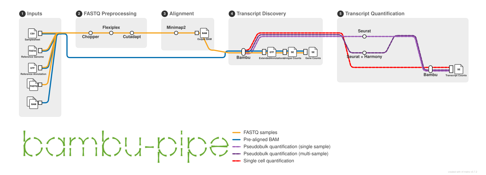

# **Context-Aware Transcript Quantification from Long-Read Single-Cell and Spatial Transcriptomics Data**
### **Content**
- [Overview](#overview)
- [Installation](#installation)
- [General Usage](#general-usage)
- [Parameters](#parameters)
- [Spatial Analysis](#spatial-analysis)
  - [Visium Spatial Gene Expression](#visium-spatial-gene-expression)
  - [Visium HD](#visium-hd)
- [Output](#output)
- [Advanced Usage](#advanced-usage)
- [Additional Information](#additional-information)
- [Release History](#release-history)
- [Citation](#citation)
- [Contributors](#contributors)


### **Overview**


This pipeline performs context-aware transcript discovery and quantification from long-read single-cell and spatial transcriptomics data. The workflow is divided into three stages:

**Preprocessing**
1. (Optional) Quality score filtering with [Chopper](https://github.com/wdecoster/chopper)
2. Barcode/UMI identification and demultiplexing with [Flexiplex](https://davidsongroup.github.io/flexiplex/)
3. Primer removal with [Cutadapt](https://cutadapt.readthedocs.io/en/stable/)

**Alignment**

4. Genome alignment with [Minimap2](https://lh3.github.io/minimap2/minimap2.html)

**Transcript Discovery and Quantification**

5. Read class construction and transcript discovery with [Bambu](https://github.com/GoekeLab/bambu/tree/BambuDev) (performed jointly across all samples)
6. (Optional) Transcript quantification with Bambu using one of two modes:
   - Cluster-level EM: Gene expression-based cell clustering with [Seurat](https://github.com/satijalab/seurat) across all samples, followed by per-sample cluster-level transcript quantification
   - Single-cell EM: Transcript quantification for each cell, or for each spot in spatial samples

### **Installation** 
Install the following dependencies before running the pipeline:
- [Nextflow](https://www.nextflow.io/docs/latest/install.html) ≥ 26.04.0
- [Docker](https://docs.docker.com/engine/install/ubuntu/) (or [Singularity](https://docs.sylabs.io/guides/3.0/user-guide/installation.html) if you do not have user permissions for Docker). 

### **General Usage** 
To run the pipeline, you must provide a samplesheet, reference genome, and reference annotation file as input. The pipeline performs transcript discovery and quantification on either a single sample or multiple samples based on the number of samples specified in the samplesheet. Refer to the [Parameters](#parameters) and Samplesheet (CSV) sections below for more details. 

**Running the pipeline**

Use the command below to run the pipeline on the test data provided in `examples/`
``` 
nextflow run main.nf \
  --input examples/samplesheet_test_sc_fastq.csv \
  --genome examples/GRCh38.primary_assembly.genome.chr21.fa.gz \
  --annotation examples/gencode.v49.primary_assembly.annotation.chr21.gtf.gz \
  -profile singularity,hpc
``` 

**Samplesheet (CSV)**

The pipeline requires a `.csv` formatted samplesheet to define the input data. This file is mandatory, regardless of the number of samples being processed. Each row in the samplesheet represents a single sample and its corresponding file path and metadata. 

*Required Columns*

The samplesheet must include the following columns:
- `sample`: sample name (no spaces or non-alphanumeric characters)
- `path`: path to the input file (`fastq` or `bam`)
- `chemistry`: 10x library chemistry (see Supported 10x Library Chemistries below)
- `technology`: sequencing technology (`ONT` or `PacBio`)

> **Note:** The first row of the samplesheet must be a header containing the exact column names: `sample`, `path`, `chemistry`, and `technology`.

*Supported Input Formats*

The `path` column can point to the following file types:
- `fastq`: Raw reads (compressed `.gz` or uncompressed)
- `bam`: Demultiplexed and aligned reads

For more details on starting the pipeline directly from BAM, please refer to the [Advanced Usage](#advanced-usage) section.

*Example Samplesheet (Single Sample)*
```csv
sample,path,chemistry,technology
10x5v2_ONT_example,examples/10x5v2_ONT_example.fastq.gz,10x5v2,ONT
```

*Example Samplesheet (Multiple Samples)*
```csv
sample,path,chemistry,technology
10x5v2_ONT_example,examples/10x5v2_ONT_example.fastq.gz,10x5v2,ONT
10x5v2_PacBio_example,examples/10x5v2_PacBio_example.fastq.gz,10x5v2,PacBio
10x5v3_ONT_example,examples/10x5v3_ONT_example_demultiplexed.bam,10x5v3,ONT
```

> **Note:** Example samplesheets are provided in `examples/`. If all samples share the same library chemistry and/or sequencing technology, you may omit the `chemistry` and `technology` columns and use the `--chemistry` and `--technology` flags instead.


*Supported 10x Library Chemistries*

For the following chemistries, the pipeline handles the full workflow — FASTQ preprocessing, genome alignment, and transcript discovery and quantification. Please specify the sample chemistry in the samplesheet as shown:
- `10x3v2` (Single Cell 3' v2)
- `10x3v3` (Single Cell 3' v3 & Next GEM Single Cell 3' v3.1)
- `10x3v4` (GEM-X Single Cell 3' v4)
- `10x5v2` (Single Cell 5' v2)
- `10x5v3` (GEM-X Single Cell 5' v3)
- `visium-v1` (Visium Spatial Gene Expression Slide 6.5 mm; serial prefix V1)
- `visium-v2` (Visium Spatial Gene Expression Slide 6.5 mm; serial prefix V2)
- `visium-v3` (Visium Spatial Gene Expression Slide 6.5 mm; serial prefix V3)
- `visium-v4` (Visium CytAssist Spatial Gene Expression Slide 6.5 mm; serial prefix V4)
- `visium-v5` (Visium CytAssist Spatial Gene Expression Slide 11mm; serial prefix V5)

> **Note:** Visium Spatial Gene Expression samples (`visium-v*`) must be run one at a time and require a Loupe manual alignment file. See the [Visium Spatial Gene Expression](#visium-spatial-gene-expression) section for details.

*Custom Chemistries*

If your dataset uses a chemistry not listed above, or if you prefer to handle FASTQ preprocessing and genome alignment manually, provide a pre-processed, demultiplexed BAM file as input. See the [Advanced Usage](#advanced-usage) section for details.

*Visium HD*

The pipeline also supports Visium HD samples. See the [Visium HD](#visium-hd) section for more details.

**Pipeline Configuration**

*Nextflow Profiles*

To configure the executor and container, pass profile types via the `-profile` argument.

- Container profiles:
  - `singularity`: use Singularity images (recommended on HPC systems)
  - `docker`: use Docker images

- Executor profiles:
  - `hpc`: execute on an HPC system (default executor: `slurm`; edit `process.executor` in `nextflow.config` to switch to `pbs`, `sge`, etc.)
  - `local`: execute on a local machine with reduced resource limits — not recommended for full-size datasets

### **Parameters**

**Mandatory**
- `--input` [string]: Path to the samplesheet `.csv` file 
- `--genome` [string]: Path to the reference genome `.fa`, `.fasta`, or `.fa.gz` file 
- `--annotation` [string]: Path to the reference annotation `.gtf`, `.gff`, `.gtf.gz`, or `.gff.gz` file. When restarting the pipeline with `--manual_clustering`, provide the `extended_annotations.rds` file instead 

**Optional**
- `--output_dir` [string, default: 'output']: Path to the output directory
- `--chemistry` [string, default: null]: Specify if all samples in the samplesheet share the same library chemistry 
- `--technology` [string, default: null]: Specify if all samples in the samplesheet share the same sequencing technology
- `--bam_only` [boolean, default: false]: If true, stops the pipeline after genome alignment and saves BAM files only (see Advanced Usage section)
- `--qscore_filtering` [boolean, default: true]: Enable or disable quality score filtering of reads
- `--ndr` [float, default: null]: NDR threshold for Bambu transcript discovery. If not set, Bambu will recommend a suitable value
- `--deduplicate_umis` [boolean, default: true]: If true, Bambu will perform UMI deduplication 
- `--quantification_mode` [string, default: "clusteredEM"]: Quantification mode for transcript counts. Available options are:
  - "no_quant": Transcript quantification is not performed
  - "EM": Performs transcript quantification for each cell/spatial coordinate
  - "clusteredEM": Performs gene expression-based cell clustering using [Seurat](https://satijalab.org/seurat/), followed by transcript quantification at the cluster level
- `--seurat_resolution` [float, default: 0.8]: Seurat clustering resolution
- `--manual_clustering` [boolean, default: false]: If true, skips clustering and quantifies from cluster assignments generated outside the pipeline (see Advanced Usage section)

**Visium**

See the [Visium Spatial Gene Expression](#visium-spatial-gene-expression) section for more details.
- `--loupe_alignment` [string, default: null]: Path to the manual alignment `.json` file exported from Loupe Browser. Required for `visium-v*` samples

**Visium HD**

See the [Visium HD](#visium-hd) section for the required input files and samplesheet format.
- `--visium_hd` [boolean, default: false]: Enable the Visium HD workflow
- `--bins` [string, default: null]: Path to a `.csv` listing all the resolutions at which the unique counts and gene counts are computed. Required when `--visium_hd` is set
- `--clustering_bin` [integer, default: 8]: Bin size (µm) to cluster at. Must be one of the values in `--bins`.
- `--barcode_mappings` [string, default: null]: Path to the Spaceranger `barcode_mappings.parquet`. Required whenever a bin coarser than 2 µm is listed in `--bins` (e.g. 8 µm)
- `--banksy` [boolean, default: true]: If true, clusters with [Banksy](https://github.com/prabhakarlab/Banksy) using both expression and spatial position. If false, clusters on gene expression alone
- `--banksy_lambda` [float, default: 0.8]: Weight given to spatial information
- `--banksy_k_geom` [integer, default: 50]: Number of spatial neighbours per bin

### **Spatial Analysis**

#### **Visium Spatial Gene Expression**
The pipeline applies the same processing steps to both 10x Single Cell and Visium Spatial Gene Expression (`visium-v*`) samples, with two additions for Visium samples: barcodes outside the tissue are filtered out, and spatial metadata is attached to the results.

*Manual Fiducial Alignment and Tissue Detection (Loupe Browser)*

For Visium Spatial Gene Expression samples (`visium-v*`), perform manual fiducial alignment and tissue detection in [Loupe Browser](https://www.10xgenomics.com/support/software/loupe-browser/latest) before running the pipeline, and supply the exported alignment `.json` file via `--loupe_alignment`. For more information, please refer to the [Manual Fiducial Alignment](https://www.10xgenomics.com/support/software/space-ranger/latest/analysis/inputs/image-fiducial-alignment) documentation.

The pipeline uses the tissue selection to remove out-of-tissue barcodes from the BAM file before transcript discovery and quantification, and to attach spatial metadata to the generated `SummarizedExperiment` objects.

*Running the pipeline*

```bash
nextflow run main.nf \
  --input examples/samplesheet_test_visium.csv \
  --genome examples/GRCh38.primary_assembly.genome.chr21.fa.gz \
  --annotation examples/gencode.v49.primary_assembly.annotation.chr21.gtf.gz \
  --loupe_alignment examples/loupe_alignment_visium_example.json \
  -profile singularity,hpc
```

*Example: Spatial Metadata*

The spatial metadata in each row of `colData` follows the [Space Ranger tissue positions](https://www.10xgenomics.com/support/software/space-ranger/latest/analysis/outputs/spatial-outputs) format: the spatial barcode, the in-tissue flag, its array coordinates, and its pixel position in the full-resolution tissue image.

| barcode | in_tissue | array_row | array_col | pxl_row_in_fullres | pxl_col_in_fullres |
|:---|:---|:---|:---|:---|:---|
| CCAAGCTTGATCTCCT | 1 | 0 | 18 | 15260.561 | 2350.7175 |
| GAGCGCTATGTCAGGC | 1 | 0 | 20 | 15027.729 | 2349.6375 |
| CTTCGTGCCCGCATCG | 1 | 0 | 22 | 14794.896 | 2348.5576 |


#### **Visium HD**

This pipeline does not demultiplex Visium HD reads. Barcode assignment and alignment must be performed beforehand using one of the following tools, and the resulting BAM file supplied in the samplesheet:

- [Percula](https://epi2me.nanoporetech.com/epi2me-docs/tools/percula/) for ONT reads
- [visium-hd-long-reads](https://github.com/10XGenomics/visium-hd-long-reads) for PacBio reads

*Required Input Files*

Alongside the BAM file, Visium HD runs require two Spaceranger outputs:

| Spaceranger output | Description |
|---|---|
| `tissue_positions.parquet` | One file per resolution, from `binned_outputs/square_XXXum/spatial/`|
| `barcode_mappings.parquet` | Maps each 2 µm barcode to its bin at every resolution |

For more information, please refer to the [Space Ranger Spatial Outputs](https://www.10xgenomics.com/support/software/space-ranger/latest/analysis/outputs/spatial-outputs) documentation.

*Samplesheet (CSV)*

Visium HD runs take exactly one sample and only needs the `sample` and `path` columns in the input samplesheet. 
```csv
sample,path
visium_hd_example,examples/visium_hd_example.bam
```

*Bins Samplesheet (CSV)*

Visium HD captures data at 2 µm resolution, which can be aggregated into larger square bins (e.g. 8 µm or 16 µm). In this pipeline, count matrices are generated at every resolution specified. To specify the resolutions for aggregation, supply a `.csv` file to `--bins`:

```csv
resolution,tissue_positions
2,binned_outputs/square_002um/spatial/tissue_positions.parquet
8,binned_outputs/square_008um/spatial/tissue_positions.parquet
16,binned_outputs/square_016um/spatial/tissue_positions.parquet
```

The samplesheet must contain two columns: `resolution`, the bin size in µm, and `tissue_positions`, the path to that resolution's `tissue_positions.parquet` file. A row for the 2 µm resolution is required.

*Running the pipeline*

```bash
nextflow run main.nf \
  --input samplesheet_visium_hd.csv \
  --genome examples/GRCh38.primary_assembly.genome.chr21.fa.gz \
  --annotation examples/gencode.v49.primary_assembly.annotation.chr21.gtf.gz \
  --visium_hd \
  --bins bins.csv \
  --barcode_mappings barcode_mappings.parquet \
  --clustering_bin 8 \
  -profile singularity,hpc
```

For more information on the Visium HD parameters, please refer to the [Parameters](#parameters) section.

*Spatial Metadata*

For each resolution, the spatial metadata in each row of `colData` of the `SummarizedExperiment` object follows the [Space Ranger tissue positions](https://www.10xgenomics.com/support/software/space-ranger/latest/analysis/outputs/spatial-outputs) format: the spatial barcode, the in-tissue flag, its array coordinates, and its pixel position in the full-resolution tissue image. The spatial metadata is extracted from that resolution's `tissue_positions.parquet` file.

*Clustering*

Clustering is performed at a single resolution only, set by `--clustering_bin`, when `--quantification_mode` is set to `clusteredEM`. By default it uses Seurat with [Banksy](https://github.com/prabhakarlab/Banksy), which combines gene expression with spatial position. Set `--banksy false` to cluster on gene expression alone.

When clustering is skipped under `--quantification_mode EM` (i.e., spot-level EM), transcript counts are produced at every resolution listed in `--bins`.

### **Output**
All outputs from the pipeline are written to the directory specified by the `--output_dir` parameter. The pipeline produces per-sample alignment files and the combined transcript discovery and quantification results. 

*Output Structure*
```
output/
├── software_versions.yml
│
├── pipeline_info/
│   ├── execution_timeline.html
│   ├── execution_report.html
│   ├── execution_trace.txt
│   └── pipeline_dag.svg
│
├── bam/                                
│   ├── <sample>_demultiplexed.bam
│   └── <sample>_demultiplexed.bam.bai
│    # (one pair per sample for multi-sample runs)  
│
├── extended_annotations.gtf
│
├── unique_counts/
│   ├── se_unique_counts.rds
│   ├── counts.mtx.gz
│   ├── barcodes.tsv.gz
│   └── features.tsv.gz
│
├── gene_counts/
│   ├── se_gene_counts.rds
│   ├── counts.mtx.gz
│   ├── CPM.mtx.gz
│   ├── barcodes.tsv.gz
│   └── features.tsv.gz
│
├── intermediate_R/
│   ├── quant_data.rds
│   └── extended_annotations.rds
│
│   # --quantification_mode EM:
├── transcript_counts_singlecell/
│   ├── se_transcript_counts_singlecell.rds
│   ├── counts.mtx.gz
│   ├── CPM.mtx.gz
│   ├── fullLengthCounts.mtx.gz
│   ├── uniqueCounts.mtx.gz
│   ├── barcodes.tsv.gz
│   └── features.tsv.gz
│
│   # --quantification_mode clusteredEM:
├── seurat_obj.rds
│
├── transcript_counts_clusters/
│   ├── se_transcript_counts_clusters.rds
│   ├── counts.mtx.gz
│   ├── CPM.mtx.gz
│   ├── fullLengthCounts.mtx.gz
│   ├── uniqueCounts.mtx.gz
│   ├── barcodes.tsv.gz
│   └── features.tsv.gz
│
└── gene_counts_clusters/
    ├── se_gene_counts_clusters.rds
    ├── counts.mtx.gz
    ├── CPM.mtx.gz
    ├── barcodes.tsv.gz
    └── features.tsv.gz
```

*Output Structure (Visium HD)*

Visium HD runs write the count matrices for each resolution specified in the `.csv` provided to `--bins`. Each count directory holds the same files as above (`se_*.rds`, `counts.mtx.gz`, `barcodes.tsv.gz`, `features.tsv.gz`, and any additional assays).

```
output/
├── software_versions.yml
│
├── pipeline_info/
│
├── extended_annotations.gtf
│
├── unique_counts/
│   ├── unique_counts_002um/
│   └── unique_counts_<res>/
│
├── gene_counts/
│   ├── gene_counts_002um/
│   └── gene_counts_<res>/
│
├── intermediate_R/
│   ├── quant_data.rds
│   └── extended_annotations.rds
│
│   # --quantification_mode EM:
├── transcript_counts/
│   ├── transcript_counts_002um/
│   └── transcript_counts_<res>/
│
│   # --quantification_mode clusteredEM:
├── seurat_obj.rds
├── transcript_counts_clusters/
└── gene_counts_clusters/
```

**Description of the Output Files**
| File | Description 
|---|---
| `<sample>_demultiplexed.bam` | BAM file containing all demultiplexed, trimmed and aligned reads, with the barcode and UMI stored in the `CB`/`UB` tags
| `<sample>_demultiplexed.bam.bai` | BAM index for the corresponding BAM file
| `extended_annotations.gtf` | A `.gtf` file containing the novel transcripts discovered by Bambu as well as the reference annotations provided by the user.
| `seurat_obj.rds` | A [SeuratObject](https://satijalab.github.io/seurat-object/reference/Seurat-class.html) containing normalised counts, PCA embeddings, and cluster assignments. For multi-sample runs, also contains Harmony-integrated embeddings corrected for sequencing technology and capture chemistry. For Visium HD runs, holds the bins of the `--clustering_bin` resolution and, with `--banksy`, the BANKSY assay and embeddings. UMAP has not been computed. Only produced when `--quantification_mode` is set to `clusteredEM`.
| `unique_counts/se_unique_counts.rds` | A [RangedSummarizedExperiment](https://www.rdocumentation.org/packages/SummarizedExperiment/versions/1.2.3/topics/RangedSummarizedExperiment-class) object containing transcript-level unique counts at single-cell resolution, produced prior to EM quantification. Columns follow the `sampleName_barcode` naming convention.
| `gene_counts/se_gene_counts.rds` | A RangedSummarizedExperiment object containing gene-level counts at single-cell resolution. Columns follow the `sampleName_barcode` naming convention.
| `intermediate_R/quant_data.rds` | Bambu's read-to-transcript assignments for the run. Required to restart the pipeline with `--manual_clustering`.
| `intermediate_R/extended_annotations.rds` | The extended annotations as a GRangesList. Required to restart the pipeline with `--manual_clustering`.
| `transcript_counts_singlecell/se_transcript_counts_singlecell.rds` | A RangedSummarizedExperiment object containing per-cell transcript counts after EM quantification. Columns follow the `sampleName_barcode` naming convention. Only produced when `--quantification_mode` is set to `EM`.
| `transcript_counts_clusters/se_transcript_counts_clusters.rds` | A RangedSummarizedExperiment object containing cluster-level transcript counts after EM quantification. Columns follow the `clusterId` naming convention for single-sample runs, and `sampleName_clusterId` for multi-sample runs. Only produced when `--quantification_mode` is set to `clusteredEM`.
| `gene_counts_clusters/se_gene_counts_clusters.rds` | A RangedSummarizedExperiment object containing cluster-level gene counts. Columns follow the `clusterId` naming convention for single-sample runs, and `sampleName_clusterId` for multi-sample runs. Only produced when `--quantification_mode` is set to `clusteredEM`.
| `unique_counts/unique_counts_<res>/` | Visium HD only. Transcript-level unique counts at resolution `<res>`, produced prior to EM quantification. Columns follow the `sampleName_barcode` naming convention.
| `gene_counts/gene_counts_<res>/` | Visium HD only. Gene-level counts at resolution `<res>`.
| `transcript_counts/transcript_counts_<res>/` | Visium HD only. Transcript counts after EM quantification, one directory per resolution. Only produced when `--quantification_mode` is set to `EM`.
| `<assay>.mtx.gz` | Gzip-compressed sparse count matrix in [Matrix Market Exchange](https://math.nist.gov/MatrixMarket/formats.html) format (features × barcodes), one per assay present in the `SummarizedExperiment` (`counts.mtx.gz`, `CPM.mtx.gz`, `fullLengthCounts.mtx.gz`, `uniqueCounts.mtx.gz`). See the **Count Matrices** section below for what each assay contains.
| `barcodes.tsv.gz` | Gzip-compressed list of cell barcodes (one per line) corresponding to the columns of each `.mtx.gz`. Barcodes follow the `sampleName_barcode` naming convention for multi-sample runs.
| `features.tsv.gz` | Gzip-compressed three-column TSV corresponding to the rows of each `.mtx.gz`. Column 1 is the feature ID (transcript ID for transcript-level matrices, gene ID for gene-level matrices). Column 2 is the feature name (same as column 1). Column 3 is the feature type (`Transcript Expression` for transcript-level matrices, `Gene Expression` for gene-level matrices).
| `software_versions.yml` | A YAML file listing the versions of all software tools used during the pipeline run.
| `execution_timeline.html` | Pipeline execution timeline. See [Nextflow docs](https://www.nextflow.io/docs/latest/tracing.html#timeline-report).
| `execution_report.html` | Resource and runtime report for the pipeline run. See [Nextflow docs](https://www.nextflow.io/docs/latest/tracing.html).
| `execution_trace.txt` | Per-process execution trace. See [Nextflow docs](https://www.nextflow.io/docs/latest/tracing.html#trace-report).
| `pipeline_dag.svg` | Workflow DAG diagram. See [Nextflow docs](https://www.nextflow.io/docs/latest/tracing.html#dag-visualisation).

**Count Matrices**

The [RangedSummarizedExperiment](https://www.rdocumentation.org/packages/SummarizedExperiment/versions/1.2.3/topics/RangedSummarizedExperiment-class) object contains four distinct types of count matrices, which can be accessed in R using the `assays()` function. Depending on your analysis requirements you can choose from the following:
- `counts`: expression estimates
- `CPM`: sequencing depth normalised estimates
- `fullLengthCounts`: estimates of read counts mapped as full length reads for each transcript
- `uniqueCounts`: counts of reads that are uniquely mapped to each transcript 

> **Note:** In `se_unique_counts.rds`, unique counts are stored under the `counts` assay, not `uniqueCounts`.


### **Fusion Transcript Analysis (Under Development)**
This feature is still under development and will be released in a future update.


### **Advanced Usage**

**Running Pipeline with a Custom Chemistry or Pre-aligned BAM**

If your dataset uses a chemistry not listed under Supported 10x Library Chemistries, or if you prefer to perform FASTQ preprocessing and genome alignment manually, start the pipeline directly from a pre-processed, demultiplexed BAM file. The BAM file must have the barcode and UMI information encoded in the `CB`/`UB` columns.

*Samplesheet (Custom Chemistry)*

For samples with a custom chemistry, set the `chemistry` field in the samplesheet to any descriptive string.

```csv
sample,path,chemistry,technology
custom_example,examples/custom_example.bam,my_custom_chemistry,ONT
```

**Stopping the Pipeline After Alignment**

The `--bam_only` flag stops the pipeline after genome alignment, saving BAM files to `output/bam/`. This is useful when you want to inspect the aligned reads or run downstream steps separately.

```bash
nextflow run main.nf \
  --input examples/samplesheet_test_sc_fastq.csv \
  --genome examples/GRCh38.primary_assembly.genome.chr21.fa.gz \
  --annotation examples/gencode.v49.primary_assembly.annotation.chr21.gtf.gz \
  --bam_only true \
  -profile singularity,hpc
```

**Starting the Pipeline Directly from BAM**

If you have already generated BAM files (e.g. from a previous run with `--bam_only true`), you can skip the preprocessing and alignment steps by pointing the `path` column directly at the BAM files:

```csv
sample,path,chemistry,technology
10x5v2_ONT_example,examples/10x5v2_ONT_example_demultiplexed.bam,10x5v2,ONT
```

```bash
nextflow run main.nf \
  --input examples/samplesheet_test_sc_bam.csv \
  --genome examples/GRCh38.primary_assembly.genome.chr21.fa.gz \
  --annotation examples/gencode.v49.primary_assembly.annotation.chr21.gtf.gz \
  -profile singularity,hpc
```

**Visualising Clustering Results**

The `seurat_obj.rds` output contains PCA embeddings and cluster assignments but does not include a UMAP. The examples below show how to compute UMAP and visualise clusters in R.

> **Note:** These examples use output generated from the smoke tests (`test_sc_fastq` for single sample, `test_sc_multi` for multiple samples), which are not representative of real datasets.

*Single sample*
```r
library(Seurat)

obj <- readRDS("examples/seurat_obj_single_sample.rds")
dim <- min(15, ncol(obj[["pca"]]))
obj <- RunUMAP(obj, dims = 1:dim, reduction = "pca")
DimPlot(obj, reduction = "umap", label = TRUE)
```

*Multiple samples*

For multi-sample runs, UMAP is computed from the Harmony-corrected embeddings, and cells can be coloured by cluster, sample, or other metadata.
```r
library(Seurat)

obj <- readRDS("examples/seurat_obj_multi_sample.rds")
dim <- min(30, ncol(obj[["harmony"]]))
obj <- RunUMAP(obj, dims = 1:dim, reduction = "harmony")

# Colour by cluster
DimPlot(obj, reduction = "umap", group.by = "harmony_clusters", label = TRUE)

# Colour by sample
DimPlot(obj, reduction = "umap", group.by = "sample")
```

**Clustering Outside the Pipeline**

Set `--manual_clustering` to quantify from cluster assignments you generated yourself instead of the pipeline's Seurat clustering. This is done in two stages.

First, stop the pipeline after transcript discovery:

```bash
nextflow run . -profile singularity \
  --input samplesheet.csv --genome genome.fa --annotation annotation.gtf \
  --quantification_mode no_quant
```

Cluster the published `gene_counts/` matrix however you like, then write a `.csv` with `id` and `cluster` columns, where each `id` is a line of `gene_counts/barcodes.tsv.gz`:

```csv
id,cluster
sample1_AAACCCAAGAAACACT-1,cluster_0
sample1_AAACCCAAGAAACCAT-1,cluster_1
```

Next, restart the pipeline. The samplesheet supplied to `--input` must contain two columns: `clusters_path`, the cluster assignment file, and `quant_data_path`, the `quant_data.rds` written to `intermediate_R/` by the first stage.

```csv
clusters_path,quant_data_path
clusters.csv,output/intermediate_R/quant_data.rds
```

```bash
nextflow run . -profile singularity \
  --input manual_clusters.csv --genome genome.fa \
  --annotation output/intermediate_R/extended_annotations.rds \
  --manual_clustering --output_dir output_manual
```

`--annotation` takes the `extended_annotations.rds` written to `intermediate_R/` by the first stage.

*Visium HD*

The same two stages described above applies. Cluster the `gene_counts/gene_counts_<res>/` matrix of whichever resolution you want, then restart with `--visium_hd` and set `--clustering_bin` to that resolution:

```bash
nextflow run . -profile singularity \
  --input manual_clusters.csv --genome genome.fa \
  --annotation output/intermediate_R/extended_annotations.rds \
  --visium_hd --clustering_bin 8 \
  --barcode_mappings barcode_mappings.parquet \
  --manual_clustering --output_dir output_manual
```

`--bins` is not needed on the restart, and `--barcode_mappings` is only needed when `--clustering_bin` is greater than 2.

**Minimal End-to-End Smoke Test**

Example data and pre-configured profiles are provided in `examples/` to run the pipeline end-to-end automatically without preparing your own data. The commands below must be run from the project's root directory. Combine the profile `test_base` with one of the profiles below and a container profile (`singularity` or `docker`).

| Profile | Description |
|---|---|
| `test_sc_fastq` | Single-cell, single-sample ONT run from raw reads |
| `test_sc_bam` | Single-cell, single-sample ONT run from demultiplexed BAM |
| `test_sc_multi` | Single-cell, multiple-sample run with different chemistries and technologies |
| `test_visium` | Spatial (Visium), single-sample ONT run from raw reads |
| `test_visium_hd` | Spatial (Visium HD), single-sample run from demultiplexed BAM |
| `test_custom` | Custom chemistry, single-sample ONT run from demultiplexed BAM |
| `test_sc_quant_data` | Single-cell manual clustering run |
| `test_visium_hd_quant_data` | Visium HD manual clustering run, with clusters made at 8 µm |

```bash
# Single-cell: test from FASTQ input
nextflow run . -profile test_base,test_sc_fastq,singularity

# Single-cell: test from BAM input
nextflow run . -profile test_base,test_sc_bam,singularity

# Single-cell: test with multiple samples (ONT + PacBio)
nextflow run . -profile test_base,test_sc_multi,singularity

# Spatial: test Visium from FASTQ input
nextflow run . -profile test_base,test_visium,singularity

# Spatial: test Visium HD from a synthetic barcode-tagged BAM
nextflow run . -profile test_base,test_visium_hd,singularity

# Custom chemistry: test from demultiplexed BAM
nextflow run . -profile test_base,test_custom,singularity

# Single-cell: test clustered EM from manually generated clusters
nextflow run . -profile test_base,test_sc_quant_data,singularity

# Spatial: test Visium HD clustered EM from manually generated clusters
nextflow run . -profile test_base,test_visium_hd_quant_data,singularity
```

The output files from the smoke tests are written to `.smoke_test/<profile>/output/`.

### **Additional Information**
UMI correction is done at the barcode level. The longest read for each unique barcode-UMI combination is kept for analysis.

### **Citation**
If you use this pipeline, please cite our paper:

Sim, A., Ling, M. H., Chen, Y., Lu, H., See, Y. X., Perrin, A., Leng Agnes, O. B., Cao, E. Y., Chia, B., Liu, J., Wüstefeld, T., Shin, J. W., & Göke, J. (2025). Isoform-level discovery, quantification and fusion analysis from single-cell and spatial long-read RNA-seq data with Bambu-Clump. https://doi.org/10.1101/2024.12.30.630828

The following are citations for the other tools used in this pipeline:

#### Banksy
Singhal, V., Chou, N., Lee, J., Yue, Y., Liu, J., Chock, W. K., Lin, L., Chang, Y.-C., Teo, E. M. L., Aow, J., Lee, H. K., Chen, K. H., & Prabhakar, S. (2024, February 27). Banksy unifies cell typing and tissue domain segmentation for scalable spatial omics data analysis. Nature News. https://www.nature.com/articles/s41588-024-01664-3 

#### Chopper
De Coster Wouter, & Rademakers, R. (2023). NanoPack2: Population scale evaluation of long-read sequencing data. Bioinformatics, 39(5). https://doi.org/10.1093/bioinformatics/btad311

#### Cutadapt
Martin, M. (2011). Cutadapt removes adapter sequences from high-throughput sequencing reads. EMBnet.journal, 17(1), 10. https://doi.org/10.14806/ej.17.1.200

#### Flexiplex
Cheng, O., Ling, M. H., Wang, C., Wu, S., Ritchie, M. E., Göke, J., Amin, N., & Davidson, N. M. (2024). Flexiplex: a versatile demultiplexer and search tool for omics data. Bioinformatics, 40(3). https://doi.org/10.1093/bioinformatics/btae102

#### Minimap2
Li, H. (2021). New strategies to improve minimap2 alignment accuracy. Bioinformatics, 37(23), 4572–4574. https://doi.org/10.1093/bioinformatics/btab705

#### Samtools
Danecek, P., Bonfield, J. K., Liddle, J., Marshall, J., Ohan, V., Pollard, M. O., Whitwham, A., Keane, T., McCarthy, S. A., Davies, R. M., & Li, H. (2021). Twelve years of SAMtools and BCFtools. GigaScience, 10(2). https://doi.org/10.1093/gigascience/giab008

#### Seurat
Hao, Y., Stuart, T. A., Kowalski, M. H., Choudhary, S., Hoffman, P., Hartman, A., Srivastava, A., Molla, G., Shaista Madad, Fernandez-Granda, C., & Rahul Satija. (2023). Dictionary learning for integrative, multimodal and scalable single-cell analysis. Nature Biotechnology. https://doi.org/10.1038/s41587-023-01767-y

### **Contributors**
This package is developed and maintained by [Andre Sim](https://github.com/andredsim), [Chin Hao Lee](https://github.com/ch99l), [Min Hao Ling](https://github.com/lingminhao), and [Jonathan Goeke](https://github.com/jonathangoeke) at the Genome Institute of Singapore. If you wish to contribute, please leave an issue. Thank you.
